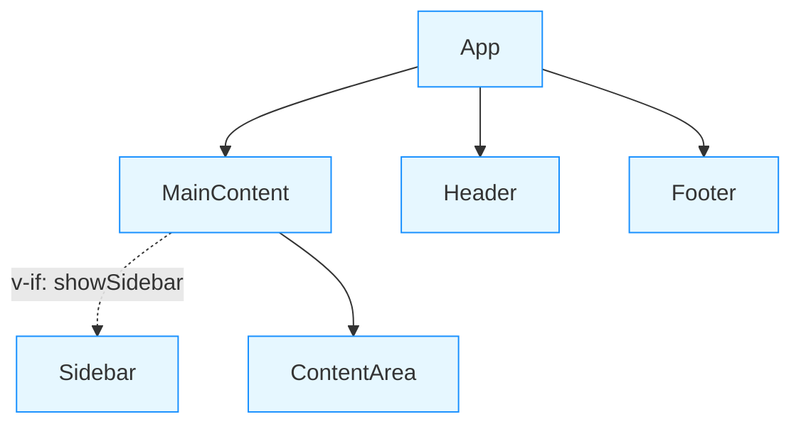

# Vue Component Diagram

A Vite plugin that automatically generates component relationship diagrams for Vue applications. This plugin analyzes your Vue components and creates a visual representation of their relationships in Markdown format with Mermaid diagrams.

## Features

- 📊 **Automatic Diagram Generation**: Creates visual component relationship diagrams
- 🔄 **Parent-Child Relationships**: Shows how components are connected
- 🔍 **Conditional Rendering Detection**: Identifies components rendered with v-if conditions
- 🧩 **Composable Usage Tracking**: (Optional) Tracks which composables are used in components
- 📝 **Markdown Output**: Generates documentation in Markdown format with Mermaid diagrams

## Installation

```bash
npm install vue-component-diagram --save-dev
# or
yarn add vue-component-diagram -D
# or
pnpm add vue-component-diagram -D
```

## Usage

Add the plugin to your `vite.config.js` or `vite.config.ts` file:

```javascript
import { defineConfig } from 'vite';
import vue from '@vitejs/plugin-vue';
import vueComponentDiagram from 'vue-component-diagram';

export default defineConfig({
  plugins: [
    vue(),
    vueComponentDiagram({
      // options (see Configuration section)
      outputPath: 'component-diagram.md',
      includeComposables: true
    })
  ]
});
```

## Configuration

The plugin accepts the following configuration options:

| Option | Type | Default | Description |
|--------|------|---------|-------------|
| `outputPath` | `string` | `'component-diagram.md'` | The file path where the component diagram will be generated |
| `includeComposables` | `boolean` | `true` | Whether to include composable usage in the diagram |

## Output Example

The plugin generates a Markdown file with a Mermaid diagram and detailed component information. Here's an example of the generated output:

```markdown
# Vue Component Diagram



## Component Details

### App

- **File Path:** `example/App.vue`
- **Used in Components:** None (Root Component)
- **Child Components:**
  - Header
  - MainContent
  - Footer

## How It Works

The plugin analyzes your Vue components during the build process by:

1. Parsing Vue Single File Components (SFCs)
2. Extracting component relationships from imports and template usage
3. Detecting conditional rendering (v-if directives)
4. Identifying composable usage (functions starting with "use" followed by uppercase letter)
5. Generating a Mermaid diagram and detailed component information

## Diagram Legend

The generated diagram uses the following conventions:

- **Solid arrows**: Direct parent-child relationships
- **Dashed arrows**: Conditional rendering (with v-if conditions)
- **Green border**: Root components
- **Blue border**: Regular components
- **Orange dashed border**: Conditionally rendered components

## Troubleshooting

### Component Not Showing in Diagram

If a component is not showing up in the diagram, check that:

1. The component is properly imported and used in your Vue files
2. The component file has a `.vue` extension
3. The component is registered in the `components` option or imported and used in the template

### Incorrect Relationships

If component relationships are incorrect, try:

1. Running a full rebuild to ensure all components are analyzed
2. Checking that component names match their file names
3. Verifying that components are properly registered and imported

## License

MIT