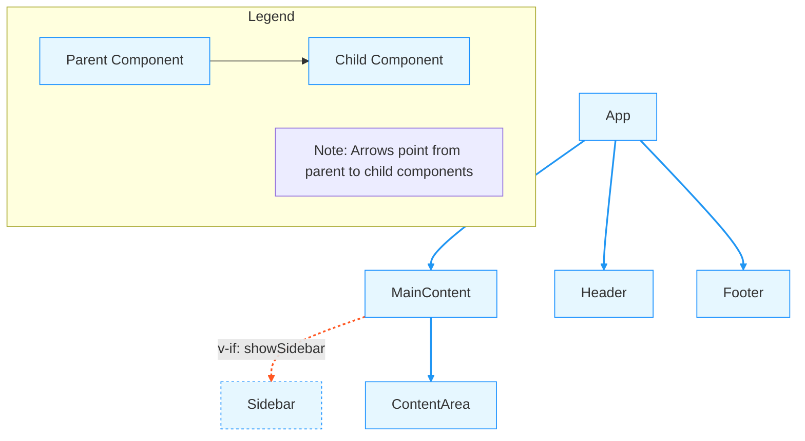

# Vue Component Diagram

## Component Details

### App

- **File Path:** `example/App.vue`
- **Used in Components:** None (Root Component)
- **Child Components:**
  - Header
  - MainContent
  - Footer

### MainContent

- **File Path:** `example/components/MainContent.vue`
- **Used in Components:**
  - App
- **Child Components:**
  - Sidebar *(conditional: v-if="showSidebar")* 
  - ContentArea

### Header

- **File Path:** `example/components/Header.vue`
- **Used in Components:**
  - App
- **Child Components:**
  - None

### Footer

- **File Path:** `example/components/Footer.vue`
- **Used in Components:**
  - App
- **Child Components:**
  - None

### Sidebar

- **File Path:** `example/components/Sidebar.vue`
- **Used in Components:**
  - MainContent
- **Child Components:**
  - None

### ContentArea

- **File Path:** `example/components/ContentArea.vue`
- **Used in Components:**
  - MainContent
- **Child Components:**
  - None

